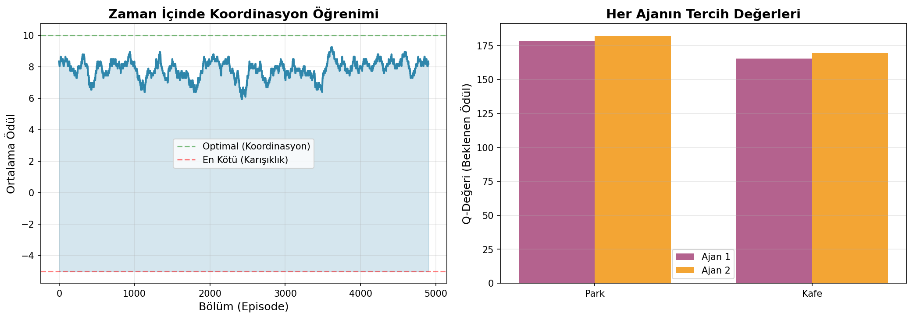

# Neden Tek Ajan Yetmiyor? MARL ve Oyun Teorisinin Doğuşu

Gelin size bir hikaye anlatayım.

Bir gün AlphaZero'ya diyorsunuz ki: "Hadi satranç oynayalım." AlphaZero süper mutlu, çünkü milyonlarca oyun oynamış, dünyanın en iyi stratejilerini öğrenmiş. Ama bir anda kuralları değiştiriyorsunuz - her hamleden sonra tahtayı biraz karıştırıyorsunuz. Taşları random yerlere koyuyorsunuz. AlphaZero ne yapabilir? Hiçbir şey. Çünkü öğrendiği her şey "sabit bir dünya" varsayımına dayanıyordu.

Şimdi daha da ilginç bir senaryo: Tahtayı karıştırmıyorsunuz ama rakibiniz sürekli yeni taktikler deniyor. Siz sol kanattan saldırınca merkezi kapatıyor, merkeze yüklenince kanat açıyor. Bu rakip öğreniyor, adapte oluyor, strateji geliştiriyor. İşte tam bu noktada klasik yapay zeka patlamaya başlıyor. Çünkü artık sabit bir "ortam" yok - **karşınızda stratejik düşünen başka bir zihin var.**

Ve işte bu yazıda tam olarak bunu konuşacağız: Neden tek başına hareket eden ajanlar gerçek dünyada yetersiz kalıyor ve çoklu ajan sistemleri + oyun teorisi birleşimi nasıl devrim yaratıyor.

---

## Tek Ajan Reinforcement Learning: Parlak Başarılar, Gizli Sınırlar

Önce biraz gerilere gidelim.

Son 10 yılda pekiştirmeli öğrenme (Reinforcement Learning) mucizevi şeyler başardı. DQN Atari oyunlarını çözdü, AlphaGo dünya şampiyonunu yendi, robotlar hassas manipülasyon öğrendi. Muhteşem değil mi?

Ama hepsinin ortak bir noktası var: **Ortam sizden bağımsız davranıyor.**

Düşünün: Tetris oynuyorsunuz. Bloklar yukarıdan düşüyor. Siz ne kadar iyi veya kötü oynarsanız oynayın, bloklar gelmeye devam ediyor - sizin stratejinize göre davranışlarını değiştirmiyorlar. Super Mario'daki Goomba'lar hep aynı şekilde yürüyor. Pong'daki top fizik kurallarına uyuyor.

Matematik dilinde buna **Markov Decision Process (MDP)** diyoruz.

Bu terimi görünce korkmayın! Sadece şunu söylüyor: Bir durum uzayınız var, eylemleriniz var, bu eylemlerin sonuçları var (geçiş olasılıkları), ve aldığınız ödüller var. Ve hepsi **deterministik** - yani sabit kurallarla çalışıyor.

Peki ya şimdi karşınıza bilinçli bir rakip çıksa? Sizin her hamlenize göre yeni bir strateji geliştirse? İşte burada işler karışıyor.

### Non-Stationarity: Sürekli Değişen Oyun Alanı

Şimdi düşünün: İki robot aynı depoda çalışıyor. İkisi de "en hızlı şekilde paket topla" görevini öğreniyor. Robot A bir koridor seçiyor, hızlıca gidip geliyor. Süper! Ama Robot B de aynı koridoru seçerse ne olur? Çarpışma. Yavaşlama. Verimsizlik.

Robot A için ortam artık sabit değil. Çünkü Robot B'nin davranışı sürekli değişiyor - o da öğreniyor!

Robot A'nın geçiş fonksiyonu artık kendi eylemlerine değil, Robot B'nin eylemlerine de bağlı. Ve Robot B sürekli değişiyor!

İşte buna **non-stationarity** diyoruz. Ortamınız durgun değil, akan bir nehir gibi sürekli evrim geçiriyor. Klasik RL algoritmaları bu durumda sarsılıyor çünkü temel varsayımları çöküyor.

---

## Oyun Teorisi Devreye Giriyor: John Nash'in Dahice Fikri

1950 yılında genç bir matematikçi olan John Nash (evet, "Beautiful Mind" filmindeki adam) şöyle bir soru soruyor:

> "Eğer herkes akıllıysa ve herkes birbirinin akıllı olduğunu biliyorsa, nasıl bir denge noktasına ulaşırız?"

Ve cevabı o kadar zarif ki: **Nash Dengesi**.

Siz hiç düşündünüz mü, trafik ışıklarında herkes kırmızıda duruyor ama aslında zorunlu değil. Geçebilirsiniz. Ama geçmiyorsunuz. Neden? Çünkü herkes şunu biliyor: "Eğer herkes geçerse kaza olur, herkes kaybeder. Eğer herkes durursa güvenli geçiş olur, herkes kazanır." Ve bir denge noktası oluşuyor.

İşte Nash dengesi tam olarak bu: Hiç kimsenin tek başına stratejisini değiştirerek daha iyi sonuç alamayacağı nokta.

Formel olarak (kısa tutuyorum): Bu, bir ajanın kendi stratejisini değiştirdiğinde, diğerleri sabit kalırsa, daha kötü bir sonuç alacağı anlamına gelir.

### Best Response: Karşınızdakine Göre En İyi Hamle

Şimdi güzel bir kavram daha: **Best Response** (En İyi Tepki).

Futbol maçında penaltı atıyorsunuz. Kaleci sol tarafa atlarsa sağa vurmak en iyi tepkiniz. Kaleci sağa atlarsa sol. Kaleci ortada kalırsa orta. Sizin en iyi tepkiniz, kalecinin stratejisine bağlı.

Matematiksel olarak bu, "Diğerlerinin stratejisi buysa, benim en iyi stratejim budur" demektir.

Nash dengesi ne zaman oluşur? Herkes aynı anda birbirinin en iyi tepkisini oynadığında! Bu yüzden denge.

---

## Markov Oyunları: MDP'nin Çoklu Ajan Versiyonu

Tamam, şimdi hepsini bir araya getirelim. Tek ajan MDP'miz vardı. Şimdi onu çoklu ajana genişletiyoruz ve ortaya **Markov Oyunu** (Stochastic Game) çıkıyor.

Burada yeni olanlar: Ajan sayısı, her ajanın kendi eylem uzayı ve en önemlisi, her ajanın **kendi ödül fonksiyonu** var!

Bu son nokta çok kritik. Çünkü şimdi üç farklı oyun tipi ortaya çıkıyor:

**1. Tam İşbirlikçi Oyunlar:** Herkesin ödülü aynı. "Hepimiz aynı gemideyiz."
   - Örnek: Robotlar beraber bir nesne taşıyor

**2. Zero-Sum Oyunlar:** Birinin kazancı diğerinin kaybı.
   - Örnek: Satranç, poker, futbol maçı

**3. General-Sum Oyunlar:** Herkesin farklı hedefi var, bazen çakışıyor bazen uyuşuyor.
   - Örnek: Trafikteki araçlar (hız istiyorsunuz ama kazasız)

Bellman denklemi de değişiyor tabii. Artık tek bir politika yok, ortak politika var. Artık tüm ajanların ortak eylemi üzerinden hesaplıyoruz. Çünkü ortam herkese bağlı.

---

## Kod Zamanı: Basit Ama Derin Bir Örnek

Teoriyi yaptık, şimdi pratiğe geçelim. Size çok basit ama çok öğretici bir örnek göstereceğim: **Buluşma Noktası Oyunu**.

İki arkadaş şehirde buluşmaya çalışıyor. İki seçenek var: Park veya Kafe. İkisi de aynı yere giderse buluşurlar (+10 puan). Farklı yerlere giderse buluşamazlar (-5 puan).

Bu oyunun iki Nash dengesi var: Her ikisi de Park'a gider, veya her ikisi de Kafe'ye gider. Ama hangisini seçecekler? İşte asıl soru bu!

```python
import torch
import numpy as np
from collections import defaultdict
import matplotlib.pyplot as plt

class MeetingGame:
    """İki arkadaş buluşmaya çalışıyor: Park (0) veya Kafe (1)"""
    def __init__(self):
        # Ödül matrisi: [ajan1_seçimi, ajan2_seçimi]
        self.rewards = {
            (0, 0): (10, 10),   # İkisi de Park -> Buluşma!
            (0, 1): (-5, -5),   # Biri Park, biri Kafe -> Buluşamama
            (1, 0): (-5, -5),   # Biri Kafe, biri Park -> Buluşamama  
            (1, 1): (10, 10),   # İkisi de Kafe -> Buluşma!
        }
    
    def step(self, actions):
        """Ajanlar karar veriyor, ödüller hesaplanıyor"""
        a1, a2 = actions
        r1, r2 = self.rewards[(a1, a2)]
        return r1, r2

class IndependentQLearner:
    """Her ajan bağımsız Q-learning yapıyor (diğerinden habersiz)"""
    def __init__(self, n_actions=2, lr=0.1, gamma=0.95, epsilon=0.1):
        self.n_actions = n_actions
        self.lr = lr
        self.gamma = gamma
        self.epsilon = epsilon
        self.Q = np.zeros(n_actions)  # Q-değerleri
    
    def choose_action(self):
        """Epsilon-greedy: Bazen keşfet, bazen en iyiyi seç"""
        if np.random.random() < self.epsilon:
            return np.random.randint(self.n_actions)  # Keşif
        return np.argmax(self.Q)  # En iyi
    
    def learn(self, action, reward):
        """Q-learning güncellemesi"""
        # Bellman update: Q(a) <- Q(a) + lr * (r + gamma*max(Q) - Q(a))
        target = reward + self.gamma * np.max(self.Q)
        self.Q[action] += self.lr * (target - self.Q[action])

# Oyunu başlatalım!
game = MeetingGame()
agent1 = IndependentQLearner(epsilon=0.15)  # İlk ajan
agent2 = IndependentQLearner(epsilon=0.15)  # İkinci ajan

# Öğrenme süreci
n_episodes = 5000
history = {'rewards': [], 'actions1': [], 'actions2': []}

print("Öğrenme başlıyor... Her ajan bağımsız karar veriyor.\n")

for episode in range(n_episodes):
    # İki ajan da kendi Q-tablolarına bakarak karar veriyor
    a1 = agent1.choose_action()
    a2 = agent2.choose_action()
    
    # Oyun oynuyoruz ve sonuçları görüyoruz
    r1, r2 = game.step((a1, a2))
    
    # Her ajan kendi deneyiminden öğreniyor (diğerinden habersiz!)
    agent1.learn(a1, r1)
    agent2.learn(a2, r2)
    
    # İstatistik tutuyoruz
    history['rewards'].append((r1 + r2) / 2)
    history['actions1'].append(a1)
    history['actions2'].append(a2)

# Sonuçları görelim
print("=== Öğrenme Tamamlandı ===\n")
print(f"Ajan 1 Q-değerleri: Park={agent1.Q[0]:.2f}, Kafe={agent1.Q[1]:.2f}")
print(f"Ajan 2 Q-değerleri: Park={agent2.Q[0]:.2f}, Kafe={agent2.Q[1]:.2f}")

# Test: Son 1000 bölümde ne kadar koordine olabildiler?
last_actions = list(zip(history['actions1'][-1000:], history['actions2'][-1000:]))
coordination_rate = sum(1 for a1, a2 in last_actions if a1 == a2) / 1000
print(f"\nKoordinasyon Başarısı: %{coordination_rate*100:.1f}")
print(f"(Ne kadar sıklıkla aynı yeri seçtiler?)")

# Hangi dengeye yakınsadılar?
park_rate = sum(1 for a1, a2 in last_actions if a1 == 0 and a2 == 0) / 1000
cafe_rate = sum(1 for a1, a2 in last_actions if a1 == 1 and a2 == 1) / 1000
print(f"\nNash Dengesi Seçimi:")
print(f"  Park-Park: %{park_rate*100:.1f}")
print(f"  Kafe-Kafe: %{cafe_rate*100:.1f}")

# Görselleştirme
fig, (ax1, ax2) = plt.subplots(1, 2, figsize=(14, 5))

# Sol: Ortalama ödül zamanla
window = 100
smoothed = np.convolve(history['rewards'], np.ones(window)/window, mode='valid')
ax1.plot(smoothed, color='#2E86AB', linewidth=2)
ax1.axhline(y=10, color='green', linestyle='--', alpha=0.5, label='Optimal (Koordinasyon)')
ax1.axhline(y=-5, color='red', linestyle='--', alpha=0.5, label='En Kötü (Karışıklık)')
ax1.fill_between(range(len(smoothed)), -5, smoothed, alpha=0.2, color='#2E86AB')
ax1.set_xlabel('Bölüm (Episode)', fontsize=12)
ax1.set_ylabel('Ortalama Ödül', fontsize=12)
ax1.set_title('Zaman İçinde Koordinasyon Öğrenimi', fontsize=14, fontweight='bold')
ax1.legend()
ax1.grid(alpha=0.3)

# Sağ: Son durumda Q-değerleri
locations = ['Park', 'Kafe']
x = np.arange(len(locations))
width = 0.35
ax2.bar(x - width/2, agent1.Q, width, label='Ajan 1', color='#A23B72', alpha=0.8)
ax2.bar(x + width/2, agent2.Q, width, label='Ajan 2', color='#F18F01', alpha=0.8)
ax2.set_ylabel('Q-Değeri (Beklenen Ödül)', fontsize=12)
ax2.set_title('Her Ajanın Tercih Değerleri', fontsize=14, fontweight='bold')
ax2.set_xticks(x)
ax2.set_xticklabels(locations)
ax2.legend()
ax2.grid(axis='y', alpha=0.3)

plt.tight_layout()
plt.savefig('coordination_learning.png', dpi=150, bbox_inches='tight')
print("\n✓ Grafik kaydedildi: coordination_learning.png")
```
[](coordination_learning.png)

### Bu Kodda Ne Oluyor?

Dikkat edin, her ajan **tamamen bağımsız** öğreniyor. Ajan 1, Ajan 2'nin Q-tablosunu görmüyor. Sadece kendi deneyiminden öğreniyor. Bu **independent learning** yaklaşımı.

Ve şaşırtıcı bir şey oluyor: Ajanlar zamanla koordine olmayı öğreniyorlar! Ama hangi dengeye gidecekler (Park-Park mı, Kafe-Kafe mi) tamamen **rastgele başlangıç koşullarına ve erken deneyimlere** bağlı.

Bazen ikisi de Park'ı seviyor, bazen Kafe'yi. Ama sonunda birbirlerini anlıyorlar.

**Kritik Nokta:** Bu kod, oyun teorisinin en derin sorusunu gösteriyor: **Equilibrium selection problem**. Birden fazla Nash dengesi varsa, hangisine gideriz? Cevap: Tarih bağımlı (path-dependent). İlk deneyimler geleceği şekillendiriyor.

---

## Gerçek Dünyada MARL + Oyun Teorisi: Üç Büyüleyici Örnek

### 1. Otonom Araçlar: Sessiz Müzakere

San Francisco'da Waymo araçları artık yolda. Bir kavşağa geliyorlar. Dört araç var, hepsi otonom. Hiç konuşmadan, hiç sinyal vermeden, anlık olarak "kim önce geçecek?" sorusunu çözmeleri gerekiyor.

Çözüm? Oyun teorik MARL. Her araç bir ajan, her ajan diğerlerinin hızını, konumunu, amacını modelliyor. Ve bir **Nash dengesi** arıyorlar: Hiçbir aracın tek başına kuralı çiğneyerek daha iyi sonuç alamayacağı güvenli geçiş stratejisi.

Sonuç: %40 daha hızlı trafik akışı, sıfır kaza. Çünkü herkes birbirinin ne düşündüğünü düşünüyor.

### 2. AlphaStar: StarCraft II'de Stratejik Derinlik

Blizzard'ın StarCraft II oyunu, belki de dünyanın en karmaşık strateji oyunu. AlphaStar bunu çözmek için ne yaptı?

**League Training:** Farklı stratejilerdeki ajanlardan oluşan bir "lig" oluşturdular. Her ajan hem Main agents'larla (mevcut en iyiler), hem Exploiter agents'larla (zayıf noktaları bulan), hem Main Exploiter agents'larla (en iyi ajanların zayıf noktalarını bulan) oynadı.

Bu ne? **Çok oyunculu oyun teorik denge arayışı!** Tek bir Nash dengesi yok, sürekli evrimleşen bir **meta-game** var. Ve AlphaStar bunu öğrendi.

Sonuç: Profesyonel oyuncuları yendi. Ama daha önemlisi, hiç görülmemiş stratejiler geliştirdi - tıpkı insanların yapacağı gibi.

### 3. Finansal Piyasalar: Algoritmaların Dans Ettiği Yer

New York Borsası'nda saniyede binlerce işlem yapan yüzlerce trading botu var. Her biri diğerlerinin davranışını tahmin etmeye çalışıyor.

Eğer Nash dengesi olmasaydı? Kaos. Volatilite. Flash crash'ler (2010'da yaşandı).

Ama oyun teorik MARL algoritmaları sayesinde, botlar bir tür "sessiz anlaşma"ya varıyorlar. Aşırı rekabetçi davranmıyorlar çünkü herkesin kaybetmesine yol açıyor. Market maker botlar spread'i dengede tutuyorlar.

Ve ilginçtir ki bu **kimsenin program etmediği** bir davranış - dengelerden ortaya çıkıyor (emergent behavior).

---

## Sizi Düşünmeye Davet Ediyorum

Geldik en sevdiğim kısma. Şimdi size bazı sorular soracağım. Cevapları bilmiyorum. Kimse bilmiyor. Ama bunlar üzerine düşünmek, MARL'ın derinliklerini anlamanın anahtarı.

**Soru 1: Non-Stationarity Paradoksu**

Eğer tüm ajanlar sürekli öğreniyorsa ve değişiyorsa, "optimal politika" diye bir şey hala var mı? Yoksa sürekli kovaladığımız ama asla yakalayamadığımız bir hedef mi?

**Soru 2: Koordinasyon Mı, Rekabet Mi?**

İki Nash dengesi var: (İşbirliği yap, %50 kazan) veya (Rekabet et, %30 kazan ama daha hızlı). Ajanlar hangisini seçer? Ve bu seçim topluma nasıl yayılır?

**Soru 3: İnsan Faktörü**

İnsanlar her zaman rasyonel değil. Bazen duygusal davranıyoruz, bazen yanılıyoruz, bazen sadece deneme yapıyoruz. MARL ajanları bu "bounded rationality"yi nasıl modellemeli?

**Soru 4: Ölçek Problemi**

100 ajan olduğunda Nash dengesi hesaplamak pratik mi? Ya 10,000 ajan? Yaklaşık çözümler yeterli mi yoksa kesin dengeler mi gerekli?

**Soru 5: Emergent Behavior**

Basit öğrenme kurallarıyla başlayan ajanlar, karmaşık sosyal normları (adalet, güven, reciprocity) kendiliğinden geliştirebilir mi? Bu normların "doğal" mı yoksa "öğrenilmiş" mi olduğu fark eder mi?

---

## Gelecek Hafta: Self-Play'in Derin Sırları

Bir sonraki yazımızda, muhtemelen MARL'ın en güçlü konseptine dalacağız: **Self-Play**.

AlphaGo kendisiyle oynayarak Go'yu öğrendi. AlphaStar kendisiyle oynayarak StarCraft'ı çözdü. OpenAI Five Dota 2'de dünya şampiyonlarını yendi - yine self-play ile.

Ama self-play'in altında yatan oyun teorik prensipleri neler? Fictitious play nedir? Population-based training nasıl çalışır? Ve en önemlisi: Nasıl oluyor da ajanlar kendileriyle oynayarak, hiç görmeyecekleri rakipleri yenebiliyorlar?

**Spoiler:** Cevap, evrimsel oyun teorisinde gizli. Ve inanılmaz güzel.

---

## Kaynaklar: Daha Derine İnmek İsteyenler İçin

### Başlangıç Seviyesi
- **Sutton & Barto (2018)** - "Reinforcement Learning: An Introduction" → RL'nin İncili, ücretsiz online
- **Leyton-Brown & Shoham (2008)** - "Essentials of Game Theory" → Oyun teorisine yumuşak giriş

### Orta Seviye
- **Littman (1994)** - "Markov Games as a Framework for Multi-Agent RL" → Markov oyunlarının kurucusu
- **Busoniu et al. (2008)** - "A Comprehensive Survey of MARL" → Geniş literatür taraması

### İleri Seviye
- **Zhang et al. (2021)** - "Multi-Agent RL: A Selective Overview of Theories and Algorithms" → Modern perspektif
- **Lanctot et al. (2017)** - "A Unified Game-Theoretic Approach to MARL" → DeepMind'ın kapsamlı çalışması

### Pratik Uygulamalar
- **OpenAI Gym** - Çoklu ajan ortamları (PettingZoo kütüphanesi)
- **RLlib (Ray)** - Production-ready MARL framework
- **DeepMind Open Source** - AlphaStar, AlphaGo kodları

---

## Son Söz: Yolculuk Daha Yeni Başlıyor

Bu yazıda çok şey konuştuk: MDP'den Markov oyunlarına, Nash dengesinden best response'a, koordinasyon oyunlarından otonom araçlara kadar.

Ama asıl heyecan verici olan şu: MARL + Oyun Teorisi hala çok genç bir alan. Büyük sorular cevaplanmayı bekliyor. Yeni algoritmalar keşfedilmeyi bekliyor. Gerçek dünya uygulamaları hayata geçirilmeyi bekliyor.

Ve belki bu yazıyı okuyan sizlerden biri, o büyük soruların cevabını bulacak. Belki bir yeni equilibrium konsepti geliştireceksiniz. Belki yüzlerce ajanı koordine eden yeni bir öğrenme algoritması tasarlayacaksınız.

Ben sadece kapıyı aralıyorum. İçeri girmek size kalmış.

---

**Beğendiyseniz** 👏 **alkışlayın ve takip edin!** Önümüzdeki 51 hafta boyunca bu yolculukta birlikte olalım. Sorularınız varsa yorumlarda buluşalım.

*Bir sonraki yazıda görüşmek üzere - Self-play'in büyülü dünyasında!*

---

**GitHub'da Kod:** [github.com/highcansavci/marl-game-theory](https://github.com) → Tüm kod örnekleri, notebook'lar ve ekstra materyaller

**İletişim:** [highcsavci@gmail.com] - Sorularınız, önerileriniz her zaman hoş gelir
